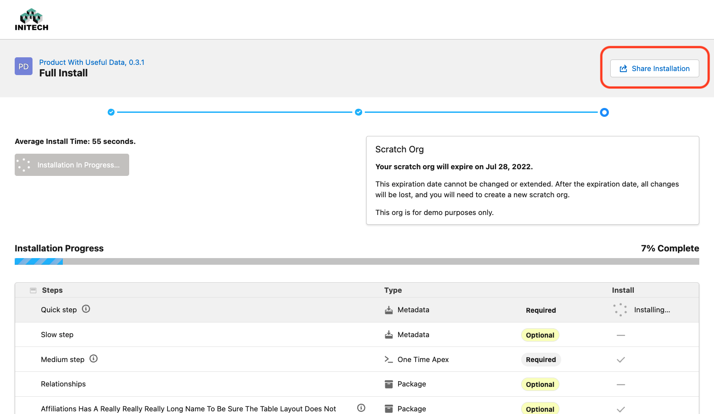
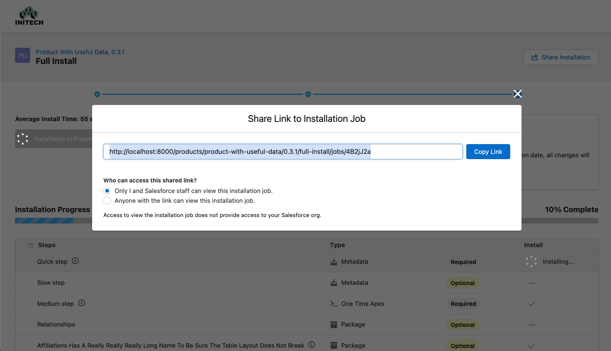

# Administiring MetaDeploy

## Cancel a Running Preflight Check or Job

If end users encounter a scenario where an installation is going slowly or stalled out, an administrator can cancel the preflight check or job for them.

Have the user provide you with a link to their installation by utilizing the "Share Installation" button in the top right:

The user will be shown a modal where they can copy a link which they will then need to provide to you (the administrator).

Navigate to the link and look for the red "Cancel Installation" button which you can click.
Note that the installation does not cancel immediately, and can sometimes take several minutes.

Once cancelled the end user can attempt to installation again.
