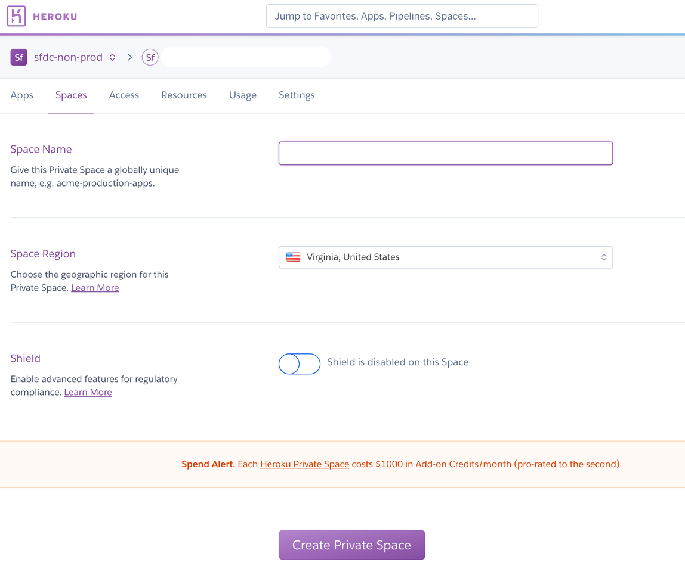
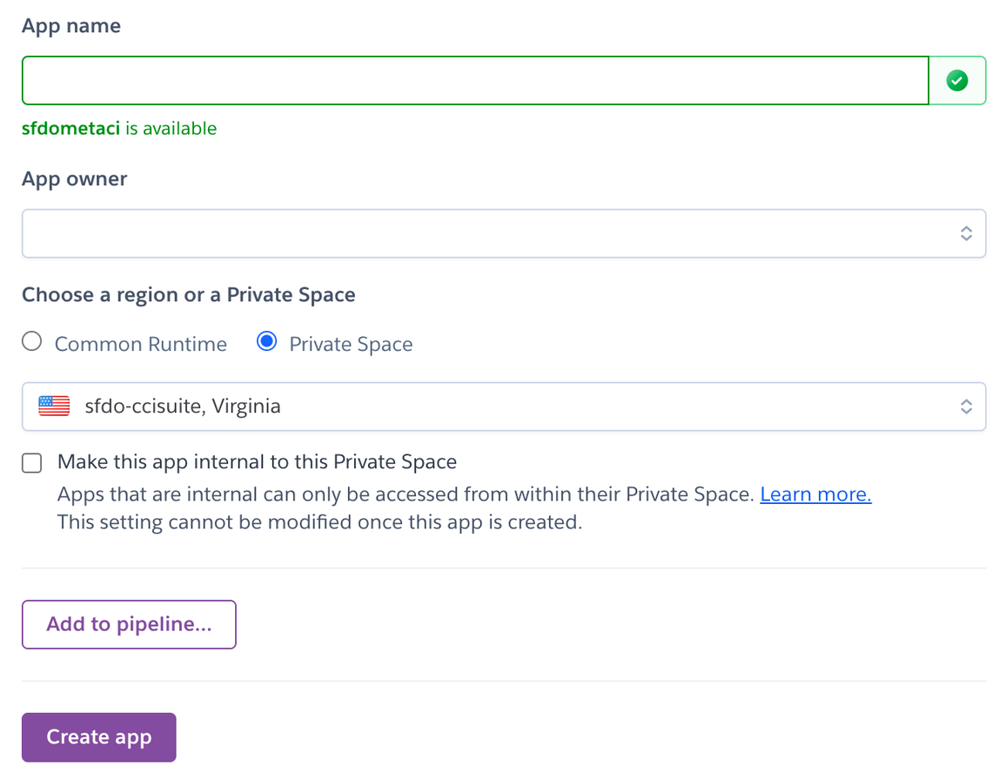
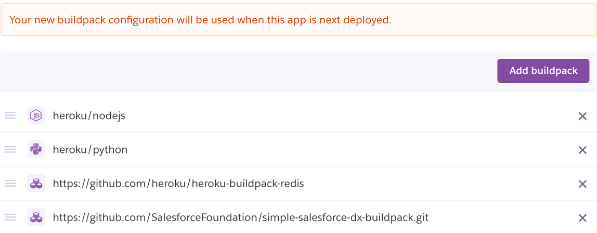
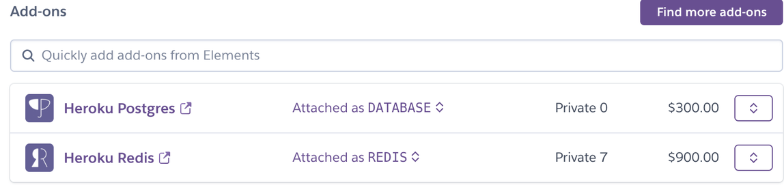
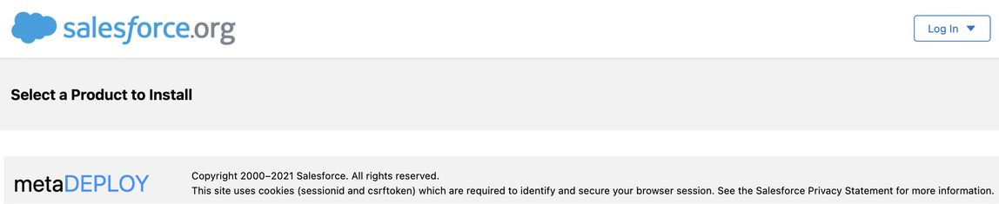
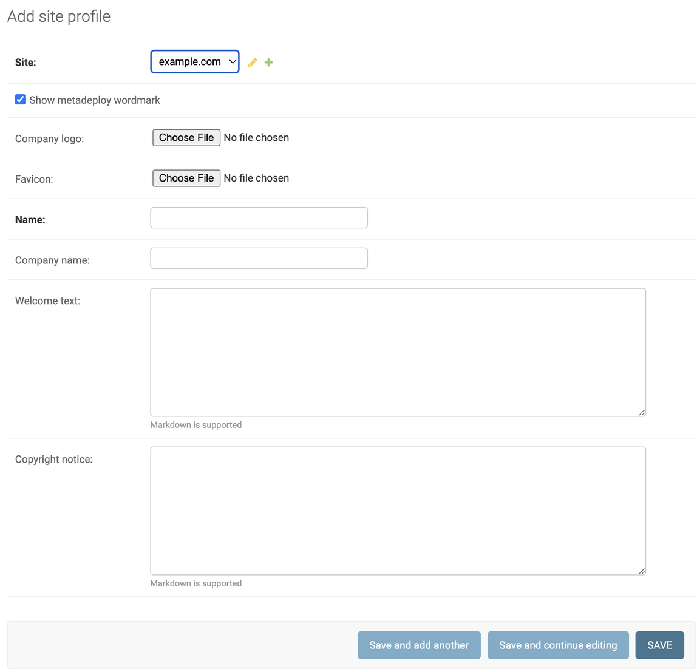

# Running MetaDeploy on Heroku

This document outlines the steps necessary for the installation and setup of a new MetaDeploy instance in Heroku. Thanks to Claudio Moraes for developing this setup guide.

Before you start, ensure you are familiar with Heroku, personal vs enterprise account, private spaces, security guidelines, pipeline, Heroku drains, and all related Heroku functionality.

## Requirements

* Heroku Enterprise Account
* [Heroku CLI](https://devcenter.heroku.com/articles/heroku-cli) 
* GitHub Account
* Your repository must be set up as a CumulusCI project and hosted on [github.com](http://github.com/)

## Pre-Deployment

### Create a Private Space on Heroku [*OPTIONAL*]

If you don’t already have a private space to use, create a [Private Space](https://devcenter.heroku.com/articles/private-spaces) to contain the MetaDeploy app. (_This is an optional step to ensure that communication between the app and its datastores is on a private network._)


**NOTE:** If this will be your main instance, it is recommended that you set up a staging and production copy for the MetaDeploy app in separated Private Spaces. It is also recommended that you configured a pipeline so updates can first be tested in staging and then promoted to production.

It will take a few minutes for the Private Space creation process to complete.

### Create MetaDeploy App

Create an app in the Private Space where you will deploy MetaDeploy.



### Buildpack Configuration

Navigate to the Settings tab and add the following Buildpacks, in this order:

* `heroku/nodejs`
* `heroku/python`
* `https://github.com/heroku/heroku-buildpack-redis`
* `https://github.com/SalesforceFoundation/simple-salesforce-dx-buildpack.git`buil



### Data Addons Configuration

Navigate to the Resources tab and add and configure the following Data addons:

* Heroku Postgres - Private 0 plan, Postgres will be inside the private space
* Heroku Redis - Private 7 plan, Redis will be inside the private space. Set [Redis addon's timeout to 0](https://devcenter.heroku.com/articles/heroku-redis#timeout).

If you are not using a Private Space, you may be able to use smaller and less expensive Heroku data resources.

You should see a screen similar to the following after adding the addons:



After provisioning finishes,[set the timeout to 0](https://devcenter.heroku.com/articles/heroku-redis#timeout) using the Heroku CLI command line: `heroku redis:timeout --app yourmetadeployapp --seconds 0`

Ensure you are first logged in to Heroku CLI - replace `yourmetadeployapp` with the name of your Heroku app.

If the previous command line does not work try: `heroku redis:timeout <redis instance> -a <yourmetadeployapp> -s 0`


### Create a GitHub app

MetaDeploy uses a [GitHub app](https://docs.github.com/en/developers/apps/creating-a-github-app) to interact with the GitHub API and fetch repository contents from GitHub.

Create a GitHub app to represent this instance of MetaDeploy with the following configuration. Replace `yourmetadeployapp` with the name of your Heroku app.

* GitHub App name: Choose its name
* Homepage URL: `https://yourmetadeployapp.herokuapp.com/`
* Permissions:
  * Repository permissions:
    * Contents: read
* For "Where can this GitHub app be installed?", choose "only on this account" to limit your GitHub app to repositories you own. 

Click on Create GitHub App. You should see the following message at the top

> Registration successful. You must generate a private key to install your GitHub app.

Click on the "generate a private key" link on the message or scroll down until you see the "Generate a private key" button and then click on it. Make sure you store the generated private key as you will need it next.


### Create a new Salesforce Connected App

MetaDeploy uses a Salesforce Connected app to authenticate to a Dev Hub org and scratch orgs using OAuth2. We suggest creating this Connected App in a permanent Salesforce org owned by your team, such as a Developer Edition org. Don't create it in your packaging org.

In Setup, go to App Manager and click the New Connected App button. Configure as follows. Replace `yourmetadeployapp` with the name of your Heroku app.

* *Callback URL*: `https://**yourmetadeployapp**.herokuapp.com/accounts/salesforce/login/callback/`
* *Selected OAuth Scopes:*
    * Full access (full)
    * Perform requests on your behalf at any time (refresh_token, offline_access)
    * Manage user data via Web browsers(web)

Save your Connected App. Make sure to capture the Consumer Key and Consumer Secret values and store them somewhere secure, such as a password vault.

## Deployment

### Heroku Config Vars

Set the following Heroku config vars to configure the Django application:

* `ADMIN_API_ALLOWED_SUBNETS`: this config var can be used to allow access to the admin API only from specific IPs. Use CIDR notation.
    * If you are using a Private Space and have Trusted IP Ranges specified, you can set `ADMIN_API_ALLOWED_SUBNETS` to `0.0.0.0/0` to allow all access from within the Trusted IP Ranges.
* `DB_ENCRYPTION_KEY`: Run `python -c 'from cryptography.fernet import Fernet; print(Fernet.generate_key().decode())'` to generate a key for this.
    * If you get an error you may need to install the cryptography module: `pip3 install cryptography`
* `DJANGO_ADMIN_URL`: A value other than `admin`. By default, admin users can access Django admin UI at `/admin`. It is recommended that you define a different path to reduce exposure to attacks.
* `DJANGO_ALLOWED_HOSTS`: `yourmetadeployapp.herokuapp.com`
    * Determines which domains Django will accept traffic for. Set it to a comma-separated list of the domains that can be used to access the app
* `DJANGO_SECRET_KEY`: Used for signing session cookies. Set this to an arbitrary string.
* `DJANGO_HASHID_SALT`: Used for hashing record ids for use in the API. Set this to an arbitrary string.
* `DJANGO_SETTINGS_MODULE`: `config.settings.production`

Set the following Heroku config vars to configure GitHub access:

* `GITHUB_APP_ID`: *App ID* for the GitHub app. Find this value by navigating to the GitHub App and selecting the General pane.
* `GITHUB_APP_KEY`: Private key for the GitHub app - this is the private key that you generated.

Set the following Heroku config vars to configure Salesforce access:

* `CONNECTED_APP_CALLBACK_URL`: [https://yourmetadeployapp.herokuapp.com/accounts/salesforce/login/callback](https://sfdometecho.herokuapp.com/accounts/salesforce/login/callback/)/ - same value that was entered for *Callback URL* when creating the Connected App
* `CONNECTED_APP_CLIENT_ID`: *Consumer Key* from the Connected App
* `CONNECTED_APP_CLIENT_SECRET`: *Consumer Secret* from the Connected App

### Deploy MetaDeploy

Follow these steps to deploy the MetaDeploy project from GitHub into your Heroku infrastructure

Cloning the project:

```
$ git clone https://github.com/SFDO-Tooling/MetaDeploy.git yourmetadeployapp
$ cd yourmetadeployapp
```

Add the Heroku remote (you need to be logged into Heroku to use Heroku CLI):

```
$ heroku git:remote -a yourmetadeployapp
```

Deploy the local project to Heroku:

```
$ git push heroku main
```

On the app’s Heroku Resources tab, scale your dynos. You can choose between two configurations:

* **Option 1** (for dev/testing; can only run one install job at a time): Scale to at least 1 `web` dyno and exactly 1 `devworker` dyno.


* **Option 2** (for production; can runn multiple install jobs in parallel): Scale to at least 1 `web` dyno, exactly 1 `worker-short` dyno, and any number of `worker` dynos. The number of `worker` dynos will govern your maximum parallel jobs.

### Create Superuser

Run the following command to create a superuser that will allow you to use Django admin UI for administration tasks:

```
heroku run ./manage.py createsuperuser --username **USERNAME** --email **EMAIL** -a **YOURMETADEPLOYAPP**
```

Enter the requested information:

* Username: the name you will give to this admin user
* Email address: email address associated with this user where you will receive notifications
* Password: user’s password

Test the created superuser by logging into the Django admin UI at `https://yourmetadeployapp/admin`. Make sure to replace `admin` with the value you defined in the `DJANGO_ADMIN_URL` variable.

## Set up an Installer

Make sure that the GitHub app you previously created is installed and has access to the GitHub repository you are working with.

See the [MetaDeploy tutorial](./docs/tutorial.md) for the remaining steps to set up a product and publish an installer which is also included below.

## Configuring Branding (Website Logo and Footer Information)

Use the following steps to define a logo that will be displayed at the top left of your MetaDeploy website and the footer information that will be displayed at the bottom:



In your MetaDeploy Django admin screen go to *Site Profiles*. Create a new Site Profile by clicking on “+ADD SITE PROFILE” at the top right and filling in the required information:

